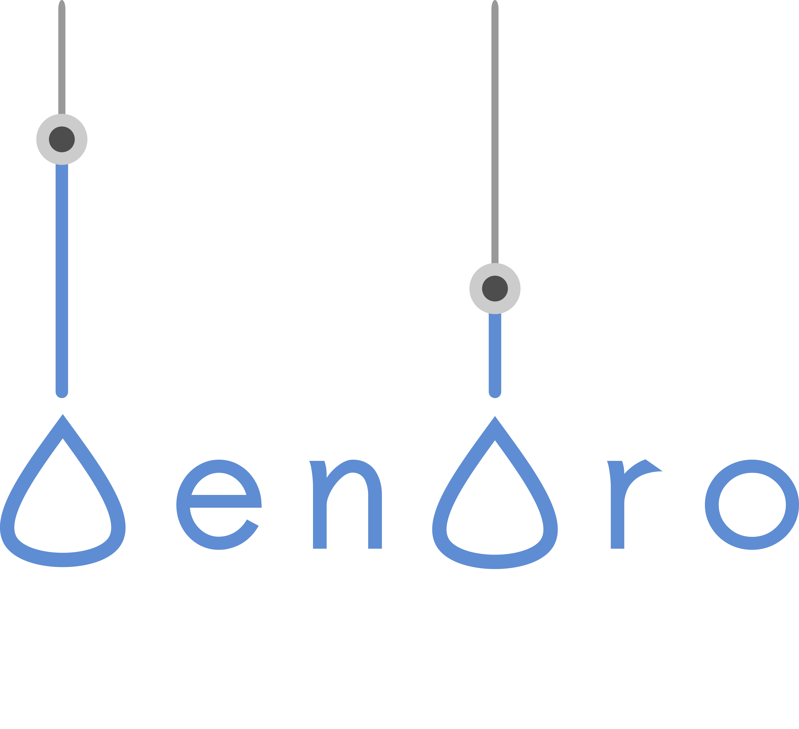

# DendroTweaks


<p>

**DendroTweaks** is a Python toolbox designed to facilitate the creation and validation of single-cell biophysical models with active dendrites. 

It features both a standalone python library and an interactive
web-based GUI.

This repository contains the code for the standalone version.
Please find out more in the official documentation [dendrotweaks.readthedocs.io/latest/](https://dendrotweaks.readthedocs.io/en/latest/index.html)

You can access the GUI online at out platform at [dendrotweaks.dendrites.gr](https://dendrotweaks.dendrites.gr)

For a quick overview of the toolbox, including a video demonstration, you can visit our [e-poster](https://doi.org/10.57736/abba-7149) presented at the FENS Forum 2024 in Vienna.

To learn more about the toolbox, you can read our publication in eLife.

> Roman Makarov, Spyridon Chavlis, Panayiota Poirazi (2024) DendroTweaks: An interactive approach for unraveling dendritic dynamics eLife 13:RP103324 https://doi.org/10.7554/eLife.103324.1

If you find DendroTweaks helpful for building your models, please consider citing our work.

```
@article{
    Makarov2024,
    title={DendroTweaks: An interactive approach for unraveling dendritic dynamics},
    author={Makarov, Roman and Chavlis, Spyridon and Poirazi, Panayiota},
    journal={eLife},
    volume={13},
    pages={RP103324},
    year={2024},
    doi={10.7554/eLife.103324.1}
}
```

## Repository Structure
The repository is organized as follows:

```
dendrotweaks/
├── docs/                # Sphinx documentation
├── examples/            # Example models
└── src/                 
    ├── dendrotweaks/
    │   ├── analysis/      # Morphometric and ephys analysis
    │   ├── membrane/      # Membrane mechanisms
    │   │   └── io/        # MOD file management
    │   ├── morphology/    # Tree graphs representing morphology
    │   │   └── io/        # SWC file management
    │   ├── stimuli/       # Current clamps and synapses
    │   ├── __init__.py
    │   ├── model.py       # Main interface class
    │   ├── simulators.py  # Available simulation engines
    │   └── utils.py 
    ├── LICENSE
    ├── MANIFEST.in
    ├── README.md
    ├── pyproject.toml
    └── setup.cfg
```