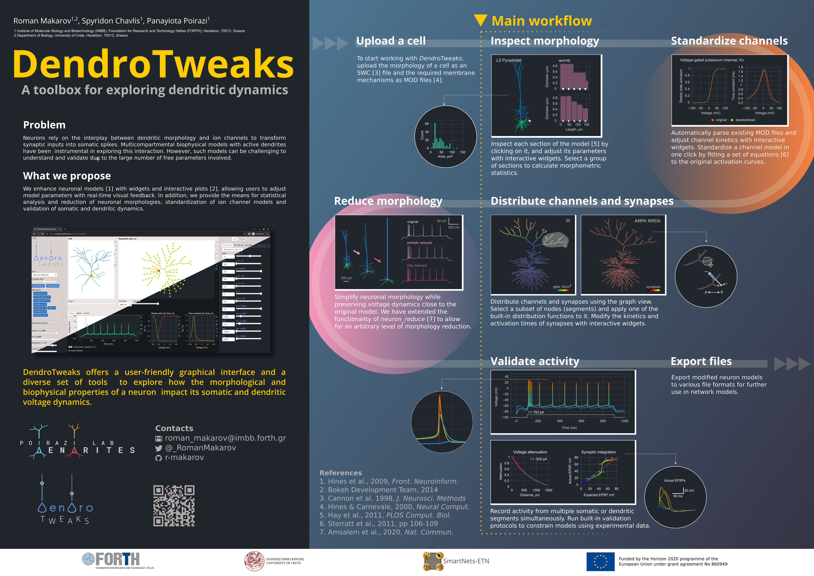

Introduction
==========================

Welcome to DendroTweaks documentation!

DendroTweaks is a Python toolbox designed to facilitate 
the creation and validation of single-cell biophysical neuronal models.

The toolbox is available both as a **standalone Python package** and as a **web-based application**.

.. list-table:: 
   :header-rows: 0
   :widths: 30 70

   * - Online platform
     - `https://dendrotweaks.dendrites.gr <https://dendrotweaks.dendrites.gr>`_
   * - PyPI project
     - `https://pypi.org/project/dendrotweaks <https://pypi.org/project/dendrotweaks/>`_
   * - Python package source code
     - `https://github.com/Poirazi-Lab/DendroTweaks <https://github.com/Poirazi-Lab/DendroTweaks>`_
   * - Web application source code
     - `https://github.com/Poirazi-Lab/DendroTweaksApp <https://github.com/Poirazi-Lab/DendroTweaksApp>`_

   
For a quick overview of the toolbox, including a video demonstration, you can visit our `e-poster <https://doi.org/10.57736/abba-7149>`_ presented at the FENS Forum 2024 in Vienna.

To learn more about the toolbox, you can read our publication in eLife.

.. admonition:: Citation 

   Roman Makarov, Spyridon Chavlis, Panayiota Poirazi (2025) DendroTweaks, an interactive approach for unraveling dendritic dynamics eLife 13:RP103324 https://doi.org/10.7554/eLife.103324.3

If you find DendroTweaks helpful for building your models, please consider citing our work.

.. code-block:: bibtex

   @article {Makarov2025,
      article_type = {journal},
      title = {DendroTweaks, an interactive approach for unraveling dendritic dynamics},
      author = {Makarov, Roman and Chavlis, Spyridon and Poirazi, Panayiota},
      volume = 13,
      year = 2025,
      month = {dec},
      pub_date = {2025-12-23},
      pages = {RP103324},
      citation = {eLife 2025;13:RP103324},
      doi = {10.7554/eLife.103324},
      url = {https://doi.org/10.7554/eLife.103324},
      journal = {eLife},
      issn = {2050-084X},
      publisher = {eLife Sciences Publications, Ltd},
   }

.. toctree::
   :maxdepth: 1
   :caption: Getting started:

   self
   installation
   changelog
   support

.. toctree::
   :maxdepth: 1
   :caption: Tutorials:

   gui
   tutorials/Quickstart
   basics
   advanced

.. toctree::
   :maxdepth: 1
   :caption: API Reference:

   genindex
   api/morphology
   api/biophys
   api/stimuli
   api/core
   api/analysis

.. toctree::
   :maxdepth: 1
   :caption: Useful resources:
      
   glossary
   literature