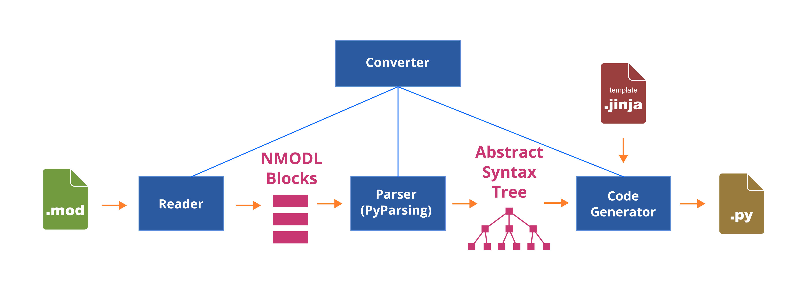
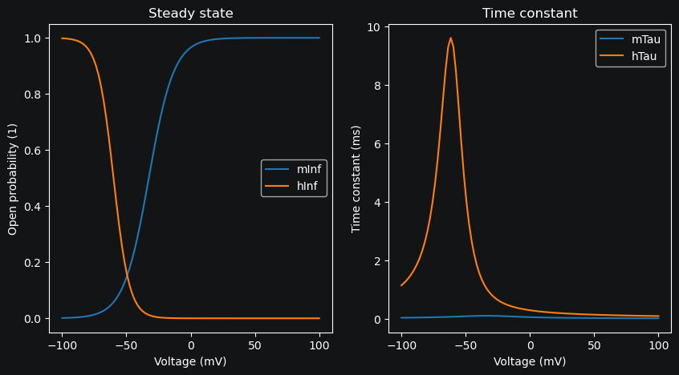

Working with MOD files
==========================================

Membrane mechanisms are the building blocks of a neuron model. They define the behavior of the membrane and are used to simulate the electrical activity of the neuron.

MOD files, written in the NMODL domain-specific language, are used to define membrane mechanisms. 
MOD files contain various blocks that define different aspects 
of the membrane mechanism. The main blocks are:

.. list-table:: 
  :widths: 20 80
  :header-rows: 1

  * - **Block**
    - **Description**
  * - **TITLE**
    - Provides a descriptive title for the model.
  * - **COMMENT**
    - Contains comments or annotations useful for explaining code or providing additional context.
  * - **NEURON**
    - Specifies the core properties of the mechanism, such as its name (suffix), the ions it interacts with, and the variables that can be accessed by the user.
  * - **UNITS**
    - Specifies custom units of measurement from the base units.
  * - **PARAMETER**
    - Declares parameters that can be set by the user.
  * - **ASSIGNED**
    - Declares variables that are assigned values during the simulation.
  * - **STATE**
    - Declares state variables that represent the state of the system.
  * - **BREAKPOINT**
    - Contains the equations that are solved at each time step during the simulation.
  * - **DERIVATIVE**
    - Defines differential equations that describe the time evolution of state variables.
  * - **INITIAL**
    - Specifies the initial conditions for state variables, setting the starting point for the simulation.
  * - **FUNCTION**
    - Defines functions that can be used within the MOD file, providing reusable code for calculations.
  * - **PROCEDURE**
    - Defines procedures that can be called within the MOD file, typically called from the BREAKPOINT block.

Each block is defined by a keyword followed by a set of parameters or statements enclosed in curly braces.

.. code-block:: 
  :caption: Example of a NEURON block
  
  NEURON {
    SUFFIX Kv
    USEION k READ ek WRITE ik
    RANGE gbar
  }

  ...

Converting MOD files into Python code
------------------------------------------

In DendroTweaks, the workflow for converting MOD files into Python code is as follows:

  
  *Figure 1: Workflow for converting MOD files into Python code*

The :code:`MODFileConverter` class conveniently encapsulates the process of converting MOD files into Python code.

.. code-block:: python

  >>> from dendrotweaks.biophys.io import MODFileConverter
  >>> converter = MODFileConverter()
  >>> converter.convert('path/to/mod_file.mod', 'path/to/output.py', 'path/to/template.py')

Reading and preprocessing MOD files
------------------------------------------

Below, we describe the individual steps involved in the conversion process.
The :code:`MODReader` class reads these files, performs basic preprocessing steps like removing comments and empty lines, and splits the file content into distinct blocks.

.. code-block:: python

  >>> from dendrotweaks.biophys import MODReader
  >>> reader = MODReader()
  >>> reader.read('path/to/mod_file.mod')
  >>> reader.preprocess()
  >>> blocks = reader.get_blocks()

Parsing MOD files
------------------------------------------

The MOD files are parsed using the `PyParsing library <https://pyparsing-docs.readthedocs.io/en/latest/index.html>`_.
The grammar used for parsing can be found in the :code:`dendrotweaks/biophys/grammar.py` file.

.. code-block:: python

  >>> from dendrotweaks.biophys import MODParser
  >>> parser = MODParser()
  >>> parser.parse(blocks)
  >>> parser.postprocess()
  >>> ast = parser.get_ast()

The parser generates an Abstract Syntax Tree (AST) from the MOD file. The AST is a hierarchical representation of the MOD file that can be used to generate Python code.

.. code-block:: json
  :caption: Abstract Syntax Tree (AST) of the NEURON block

  "NEURON": {
    "suffix": "Kv",
    "useion": [
      {
        "ion": "k",
        "read": [
          "ek"
        ],
        "write": [
          "ik"
        ]
      }
    ],
    "range": [
      "gbar",
    ]
  }

Generating Python code from MOD files
------------------------------------------

The :code:`PythonCodeGenerator` class generates Python code from the AST using a `JINJA <https://jinja.palletsprojects.com/en/stable/>`_ template file.

.. code-block:: python

  >>> from dendrotweaks.biophys import PythonCodeGenerator
  >>> generator = PythonCodeGenerator()
  >>> generator.generate(ast, 'path/to/template.py')
  >>> generator.write('path/to/output.py')
  Written to path/to/output.py

Jaxley-compatible classes
------------------------------------------

When running DendroTweaks with the NEURON backend, the mechanism classes are used primarily for visualizing the kinetics.
However, we can also generate `Jaxley <https://jaxleyverse.github.io/jaxley>`_ -compatible classes that can be used for simulations by providing a different template file.

.. code-block:: python

  >>> generator.generate(ast, 'path/to/jaxley_template.py')
  >>> generator.write('path/to/output.py')
  Written to path/to/output.py

Loading MOD files
------------------------------------------

The :code:`MODFileLoader` class simplifies the process of loading MOD files for use with the NEURON simulator.
It utilizes the :code:`neuron.load_mechanisms` `method <https://nrn.readthedocs.io/en/8.2.6/python/programming/neuronpython.html#neuron.load_mechanisms>`_ to load the mechanisms into the model dynamically.

.. code-block:: python

  >>> from dendrotweaks.biophys.io.loader import MODFileLoader
  >>> loader = MODFileLoader()
  >>> loader.load_mechanism("path/to/mod_file.mod")

Creating ion channels
------------------------------------------

The :code:`create_channel` method can be used to create an ion channel from a specific archive.
For example, we can create a sodium channel. 
This involves specifying the channel name, 
the folder from which to retrieve the MOD file, 
and the Python template to use for generating the code. 
Additionally, we can choose to load the channel immediately into the NEURON simulator by setting the `load` parameter to `True`.

.. code-block:: python

  >>> from dendrotweaks.biophys.io import create_channel
  >>> nav = create_channel(
  ...     path_to_mod_file="path/to/mod_file.mod",
  ...     path_to_python_file='path/to/python_file.py',
  ...     path_to_python_template='path/to/python_template.py',
  ... )

On the :code:`model` level, we can create an ion channel using 
the :code:`add_mechanism` method.

.. code-block:: python

  >>> model.add_mechanism(
  ...     mechanism_name='Nav', 
  ...     python_template_name='default',
  ...     load=True, 
  ...     dir_name='mod', 
  ...     recompile=True
  ... )

The :code:`mechanism_name` parameter specifies the name of 
the mechanism being added, such as `'Nav'`. 
The :code:`python_template_name` parameter indicates the 
template name to be used for the mechanism. 
The :code:`load` parameter is a boolean that determines if 
the mechanism should be loaded to NEURON. 
The :code:`dir_name` parameter specifies the directory 
where the mechanism files are located. 
Lastly, the :code:`recompile` parameter is a boolean 
that indicates if the MOD file should be recompiled.

Visualizing channel kinetics
------------------------------------------

Once the ion channel is created, its kinetics can be visualized using the `plot_kinetics` method.
To obtain the data for plotting, specify a range of membrane potentials and a temperature.

.. code-block:: python

  >>> v_range = np.linspace(-200, 200, 200)
  >>> data = nav.get_data(v_range, temperature=23)
  Got data for v in range -200.0 to 200.0 mV at 23°C

The `plot_kinetics` method generates a plot of the channel kinetics.
It internally calls the `get_data` method to retrieve the data, so it accepts the same arguments.
Here, it is called with the default parameters.

.. code-block:: python

  >>> fig, ax = plt.subplots()
  >>> nav.plot_kinetics(ax)
  Got data for v in range -100.0 to 100.0 mV at 37°C

  *Figure 2: Visualization of channel kinetics*

Limitations and Best Practices for MOD File Parsing
--------------------------------------------------

When working with MOD files in DendroTweaks, there are certain limitations and recommended practices to ensure compatibility and maintainability.

Best Practices
~~~~~~~~~~~~~~

**Naming conventions:**
  
- For variables representing the time constant or the steady state of a state variable, include the state variable name and either :code:`tau` or :code:`inf` (notation is not case- or order-sensitive). For example, for a state variable :code:`m`, the following names are acceptable: :code:`mtau`, :code:`taum`, :code:`tau_m`, :code:`mTau`, etc.

- Do not include the mechanism suffix in variable names (e.g., use :code:`gbar`, not :code:`gnabar`). NEURON will automatically append the suffix (e.g., :code:`gbar_na`).

**Variable usage:**
  
- Set the maximal channel conductance :code:`gbar` to :code:`0.0` and use units of S/cm².

- Avoid using :code:`dt` as a parameter in the MOD file; it is reserved for NEURON's internal use.

- Avoid declaring :code:`GLOBAL` variables.

- Place variables such as :code:`v` (membrane potential) and :code:`i` (current) in the :code:`ASSIGNED` block, not in :code:`PARAMETER`.

- Avoid voltage shift parameters like :code:`v_shift`.

- Pass the independent variable (usually :code:`v` for voltage-gated channels or :code:`cai` for calcium-gated channels) as an argument to procedures.

**Code cleanliness:**
  
- Remove any unused functions or procedures from the MOD file.

- Ensure all declared variables are used and initialized appropriately.

Unsupported Features
~~~~~~~~~~~~~~~~~~~~

The following MOD file features are not supported:

**Unsupported blocks:**

- INDEPENDENT block:
  ::
  
    INDEPENDENT {t FROM 0 TO 1 WITH 1 (ms)}

- KINETIC blocks:
  ::
  
    KINETIC kin {
      : rates(v, cani)
      rates(v, cai)
      ~cst<->ost  (k3, k4)
      ~ost<->ist  (k1, 0.0)
      ~ist<->cst  (k2, 0.0)
      CONSERVE cst+ost+ist=1
    }

- VERBATIM blocks:
  ::
  
    VERBATIM
    #some C code here
    ENDVERBATIM

**Unsupported keywords:**

- FROM TO WITH keywords in the STATE block:
  ::
  
    STATE {
        z   FROM 0 TO 1
    }

- Declaration of LOCAL variables outside a block

- TABLE statements

- Multiple USEION statements in the NEURON block:
  ::
  
    NEURON {
      SUFFIX mychannel
      USEION na READ ena WRITE ina
      USEION k READ ek WRITE ik
    }

**Miscellaneous:**

- Multiple assignments on one line:
  ::
  
    aa = alf(v)  ab = bet(v)

- Scaling factors in function signatures:
  ::
  
    FUNCTION ghk(v(mV), ci(mM), co(mM)) (.001 coul/cm3) {
      ...
    }
