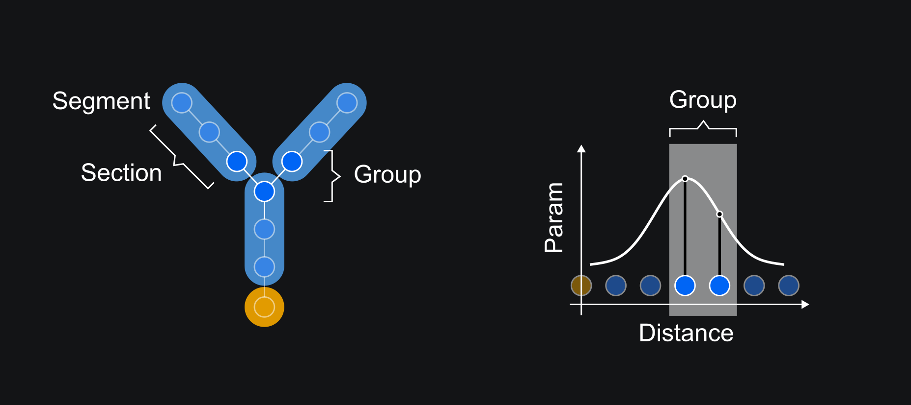

Quick Start
==========================================

This tutorial will guide you through the basic steps of creating 
a single-cell biophysical neuronal model in DendroTweaks. You will learn how to load neuronal morphologies
and membrane mechanisms, distribute parameters across the cell, add stimuli, and run a simulation.

Organizing model data
------------------------------------------

Before diving into model building, we need to establish a well-organized directory structure 
for our model data. First, choose a :code:`data` directory that will store all your models. 
Within this directory, create a unique subfolder for each model you plan to develop.

.. code-block:: bash

    /path/to/data/
        ├── UserModel1/
        ├── UserModel2/
        ...

To follow along with this tutorial, you can download the example models from the DendroTweaks repository:

.. code-block:: python

    >>> import dendrotweaks as dd
    >>> dd.download_example_data('path/to/data/')

For each model, we will need two essential components: the neuronal morphology (in SWC format) 
stored in the :code:`morphology/` folder, and the membrane mechanisms (ion channels defined 
as MOD files) placed in the :code:`biophys/mod/` folder.

.. code-block:: bash

    /path/to/data/
        ...
        └── UserModel1/
            ├── morphology/
            |  └── cell.swc
            └── biophys/
               └── mod/
                  ├── Nav.mod
                  └── Kv.mod
            
.. tip::

    Don't worry about compiling the MOD files manually - 
    DendroTweaks will handle this step automatically later in the process.

Creating a model
------------------------------------------

With our directory structure in place, we can now create a :code:`model` object. This object 
serves as the central interface for managing all model components, including morphology, 
membrane mechanisms, and stimuli.

.. code-block:: python

    >>> model = dd.Model(path_to_model='path/to/data/UserModel1/')

When we instantiate the model by specifying the path to our model directory, DendroTweaks 
automatically sets up additional required folders. It creates a :code:`Default` folder containing 
standard mechanisms and a :code:`Templates` folder with templates for converting MOD files to Python classes. 
These folders are created only once and are shared across all models. Within your model folder, it generates a :code:`stimuli` 
directory for stimulation protocols and a :code:`biophys/python` folder for storing Python files generated from MOD files.

.. code-block:: bash

    /path/to/data/
        ├── Default/
        │   ├── Leak.mod
        │   ├── CaDyn.mod
        │   ├── AMPA.mod
        │   ...
        ├── Templates/
        │   ├── channel.py
        |   ...
        │   └── standard_channel.mod
        └── UserModel1/
            ├── morphology/
            │   └── cell.swc
            ├── biophys/
            │   ├── mod/
            │   │   ├── Nav.mod
            │   │   └── Kv.mod
            │   └── python/
            └── stimuli/

This structure provides the foundation for model development. As we progress, we will add more 
files to these directories, but the basic framework is now ready.
You can learn more about the directory structure in the :doc:`tutorial</tutorials/tutorial_io>` on loading and saving models.

Loading the morphology
------------------------------------------

We proceed by loading the morphology of the cell from an SWC file.
First, we list the available morphologies in the :code:`morphology` subfolder.

.. code-block:: python

    >>> model.list_morphologies()
    ['cell']

We can load a specific morphology using the :code:`load_morphology` method.

.. code-block:: python

    >>> model.load_morphology('cell')

We now have access to :code:`point_tree`, :code:`sec_tree` and :code:`seg_tree`
attributes of the model object.

.. code-block:: python

    >>> model.point_tree
    >>> model.sec_tree
    >>> model.seg_tree

For more information about representing neuronal morphology with tree graphs, see the :doc:`tutorial</tutorials/tutorial_morpho>`.

.. warning::

    Note that the spatial discretization of the model (i.e. the :code:`seg_tree`) depends on 
    the specific membrane capacitance :code:`cm` and axial resistance :code:`Ra` of the cell.
    By default, these parameters are set to NEURON's default values.
    To learn how to change the spatial discretization of the model refer to the 
    :doc:`tutorial</tutorials/tutorial_segmentation>` on setting the spatial discretization of the model.

Adding mechanisms
------------------------------------------

After defining the neuronal morphology, we now need to specify its biophysical properties.
The biophysical properties of our model depend on the mechanisms present in the membrane.
These mechanisms are defined in MOD files as sets of equations and parameters, 
which are compiled and loaded into NEURON.

First, let's add the default mechanisms to the model, which include the leak channel, calcium dynamics and synaptic mechanisms:

.. code-block:: python

    >>> model.add_default_mechanisms(recompile=False)

However, for most of the models, we need to add user-defined mechanisms.
We can create a mechanism object from a MOD file using the :code:`add_mechanism` method.
For example, let's add the sodium and potassium channels to the model.
We can list the available mechanisms in the :code:`mod` directory:

.. code-block:: python

    >>> model.list_mechanisms()
    ['Nav', 'Kv']

Next, we will add these user-defined mechanisms to the model:

.. code-block:: python

    >>> for mech_name in ['Nav', 'Kv']:
    >>>     model.add_mechanism(mech_name, recompile=True)

With these commands, we create Python objects from MOD files and add them to :code:`mechanisms`.
We also compile and load the MOD files, making them available in NEURON.

To see all mechanisms available in the model, we can use the :code:`mechanisms` attribute.

.. code-block:: python

    >>> model.mechanisms
    {'Leak': <Mechanism(Leak)>,
     'CaDyn': <Mechanism(CaDyn)>,
     'Nav': <Mechanism(Nav)>,
     'Kv': <Mechanism(Kv)>}

Each mechanism object is an instance of the :code:`Mechanism` class, 
which contains information about the mechanism, such as its name and parameters.
To examine the parameters of a specific mechanism, we can use the :code:`params` attribute:

.. code-block:: python

    >>> model.mechanisms['Leak'].params
    {'gbar': 0.0, 'e': -70}

.. warning::

    Note that the parameters stored within the mechanisms are the default values from the MOD files.
    The actual values of the parameters used for the simulation are stored in the model object!

We can view the global parameters of the model with the :code:`params` attribute:

.. code-block:: python

    >>> model.params
    {'cm': {'all': constant({'value': 1})},
     'Ra': {'all': constant({'value': 35.4})}}

We should interpret the output as follows: the specific membrane capacitance :code:`cm` is set to a constant value of 1 :math:`\mu F/cm^2`,
and the axial resistance :code:`Ra` is set to 35.4 :math:`Ohm \cdot cm` for all segments of the cell. We will discuss how to update these parameters shortly.

.. warning::

    Note that so far we have only loaded the mechanisms without actually inserting them 
    into the membrane. Therefore, the parameters of these mechanisms are not yet included in the :code:`model.params` dictionary.
    In the next step, we will insert the mechanisms into the membrane.

Inserting mechanisms to specific domains
------------------------------------------

In DendroTweaks, membrane mechanisms are mapped to morphological domains.
A domain is a region of a neuron distinguished by its anatomical 
or functional properties. 
In a typical pyramidal cell model we have the following domains:
soma, axon, basal dendrites, apical dendrite (further subdivided into trunk, tuft, and oblique dendrites).

    *Figure 1: Domains of a pyramidal cell*

In DendroTweaks, a domain represents a collection of sections that share the same properties.
We can view the domains of the model with the :code:`domains` attribute.

.. code-block:: python

    >>> model.domains
    {'soma': <Domain(soma, 1 sections)>,
     'apic': <Domain(apic, 43 sections)>,
     'axon': <Domain(axon, 1 sections)>,
     'dend': <Domain(dend, 7 sections)>}

After uploading the mechanisms in the previous step, we now need to insert them into specific domains.
In this example, we insert each of the three available mechanisms to all domains. However, we could selectively insert mechanisms to specific domains,
such as the soma or apical dendrite.

.. code-block:: python

    >>> all_domains = ['soma', 'dend', 'axon', 'apic']
    >>> for domain in all_domains:
    >>>     model.insert_mechanism('Leak', domain)
    >>>     model.insert_mechanism('Nav', domain)
    >>>     model.insert_mechanism('Kv', domain)

We can verify which mechanisms are inserted in each domain with the :code:`domains_to_mechs` attribute.

.. code-block:: python

    >>> model.domains_to_mechs
    {'soma': ['Leak', 'Nav', 'Kv'],
     'apic': ['Leak', 'Nav', 'Kv'],
     'axon': ['Leak', 'Nav', 'Kv'],
     'dend': ['Leak', 'Nav', 'Kv']}

To examine the parameters of the inserted mechanisms, we can use the :code:`mechs_to_params` attribute.

.. code-block:: python

    >>> model.mechs_to_params
    {'Independent': ['cm', 'Ra', 'ena', 'ek'],
     'Leak': ['gbar_Leak', 'e_Leak'],
     'Nav': ['gbar_Nav', 'vhalf_m_Nav', ...],
     'Kv': ['gbar_Kv', 'vhalf_n_Kv' ...]}

Some parameters, such as specific membrane capacitance :code:`cm` and axial resistance :code:`Ra`, do not belong to any mechanism.
These independent parameters are grouped under an "Independent" pseudo-mechanism for interface consistency.
These parameters are available in each domain by default.

At this point, we have inserted the mechanisms into the membrane and set the default parameters for the model.
We can inspect the parameters of the inserted mechanisms using the :code:`params` attribute.

.. code-block:: python

    >>> model.params
    {'cm': {'all': constant({'value': 1})},
     'Ra': {'all': constant({'value': 35.4})},
     'gbar_Leak': {'all': constant({'value': 0.0})},
     'e_Leak': {'all': constant({'value': -70})},
     'gbar_Nav': {'all': constant({'value': 0.0})},
     'vhalf_m_Nav': {'all': constant({'value': -30}),
     ...
     'ena': {'all': constant({'value': 50}),
     'gbar_Kv': {'all': constant({'value': 0.0})},
     'vhalf_n_Kv': {'all': constant({'value': -35})},
     ...
     'ek': {'all': constant({'value': -77})},
     }

As we can see, all parameters are set to their default values across all segments of the cell, with some 
parameters initialized to 0.0. Before running the simulation, we need to set these parameters to more realistic
values, which we will learn how to do in the next step.

Setting model parameters
------------------------------------------

We can set the value of a parameter using the :code:`set_param` method.
As an example, let's set the conductance of the leak channel to 0.0001 S/cm^2.

.. code-block:: python

    >>> model.set_param('gbar_Leak', value=0.0001) # S/cm^2

In real neurons, properties such as ion channel density vary across different regions of the cell. 
To distribute parameters across the cell, we need to specify **where** and **how** the parameter will be distributed.

To select the segments **where** a given distribution will be applied, we use segment groups.
A segment group is a collection of segments that meet certain criteria, 
such as the diameter or distance from the soma.

To define **how** the parameter will be distributed, we use distribution functions.
A distribution function takes a segment's distance from the soma as input
and returns the parameter value at that distance. The figure below shows an example 
of a segment group for the apical nexus region and a Gaussian distribution function for a parameter, such as ion channel conductance.

    *Figure 2: Distribution of parameters across the cell*

We can set the values of the parameters for the mechanisms inserted in the model using the :code:`set_param` method,
specifying the group name and the distribution type.

.. code-block:: python

    >>> model.set_param('gbar_Nav', group_name='all', distr_type='constant', value=0.03)  
    >>> model.set_param('gbar_Nav', group_name='somatic', distr_type='constant', value=0.05) 
    >>> model.set_param('gbar_Kv', group_name='all', distr_type='constant', value=0.003) 
    >>> model.set_param('gbar_Kv', group_name='somatic', distr_type='constant', value=0.005)
    
We can use a more concise notation if a parameter doesn't vary across the cell.
If we don't provide a group name, the parameter will be set for all segments.
If we don't provide a distribution type, a constant distribution will be used.
These two examples are equivalent:

.. code-block:: python

    >>> model.set_param('gbar_Leak', group_name='all', distr_type='constant', value=0.0001) # S/cm^2
    >>> model.set_param('gbar_Leak', value=0.0001) # S/cm^2

We can also set other parameters, such as reversal potentials, temperature, and initial membrane potential.

.. code-block:: python

    >>> model.set_param('e_Leak', value=-70) # mV
    >>> model.set_param('e_k', value=-80) # mV
    >>> model.set_param('e_na', value=60) # mV
    >>> model.set_param('temperature', value=37) # degC
    >>> model.set_param('v_init', value=-70) # mV

Now, we can access the model parameters again and see that the values have been updated.

.. code-block:: python

    >>> model.params
    {'cm': {'all': constant({'value': 1})},
     'Ra': {'all': constant({'value': 35.4})},
     'gbar_Leak': {'all': constant({'value': 0.0001})},
     'e_Leak': {'all': constant({'value': -70})},
     'gbar_Nav': {'all': constant({'value': 0.03}),
                  'somatic': constant({'value': 0.05})},
     'vhalf_m_Nav': {'all': constant({'value': -30}),
     ...
     'ena': {'all': constant({'value': 50}),
     'gbar_Kv': {'all': constant({'value': 0.003}),
                 'somatic': constant({'value': 0.005})},
     'vhalf_n_Kv': {'all': constant({'value': -35})},
     ...
     'ek': {'all': constant({'value': -77})},
     }

To learn more about segment groups and parameter distributions, refer to the
:doc:`tutorial</tutorials/tutorial_distributions>` on distributing parameters.

Adding stimuli and running a simulation
------------------------------------------

We will learn how to simulate neuronal activity by applying a current stimulus 
to a neuron model and recording its response. 
This process mimics experimental electrophysiology where researchers inject current into neurons 
to study their firing properties.
We will add a current clamp stimulus to the soma and record the somatic membrane potential.

The soma is the cell body of a neuron and the main integration site for electrical signals. 
We will first select the soma section from the model using the special attribute :code:`sec_tree.soma`.

.. code-block:: python

    >>> soma = model.sec_tree.soma

To observe the neuron's activity, we need to place a recording electrode at a specific location:

We add a recording point at the center of the soma. 
The :code:`loc` parameter specifies the location along the section 
where the recording will be placed. 
It is a normalized length, with 0.0 representing the start of the section 
and 1.0 representing the end.

.. code-block:: python

    >>> model.add_recording(sec=soma, loc=0.5)

Now we will apply a current step stimulus to drive the neuron to fire action potentials. 
This mimics the experimental technique where constant current is injected into a neuron:

We specify the duration of the stimulus in ms, the delay before the stimulus starts, and the amplitude of the stimulus
in nanoamperes.

.. code-block:: python

    >>> model.add_iclamp(sec=soma, loc=0.5, amp=0.162, dur=900, delay=50)

- `add_iclamp` adds an intracellular current clamp to the soma at position 0.5 (middle of the section)
- We use a positive amplitude (0.162 nA) to depolarize the membrane
- The current starts after a 50 ms delay and lasts for 900 ms

With our recording and stimulus in place, we can now run the simulation:

.. code-block:: python

    >>> model.run(1000) # ms

This runs the simulation for 1000 milliseconds (1 second).
After the simulation completes, the voltage data is stored in 
:code:`simulator.vs` and the corresponding time points in :code:`simulator.t`. 

For more complex stimuli, such as synaptic inputs, refer to the :doc:`tutorial</tutorials/tutorial_synapses>` on adding synaptic inputs.

Analyzing the results
------------------------------------------

Finally, we can analyze the results of the simulation using some of the built-in functions.

We will use built-in DendroTweaks functions to plot the voltage trace and extract spike metrics:

.. code-block:: python

    >>> fig, ax = plt.subplots(1, 1, figsize=(10, 4))
    >>> model.simulator.plot_voltage(ax=ax)
    >>> spike_data = detect_somatic_spikes(model)
    >>> plot_spikes(spike_data, ax, show_metrics=True)
    Detected 7 spikes
    Average spike width: 0.97 ms
    Average spike amplitude: 79.08 mV
    Spike frequency: 7.78 Hz

This code plots the somatic voltage recording from our simulation 
together with the detected spikes and their metrics.

The output metrics provide important physiological information:

- **Spike amplitude**: The average amplitude of the spikes measured from the baseline to the peak.
- **Spike half-width**: The average duration of the spike at half of its peak amplitude.
- **Spike frequency**: The number of spikes per second.

    *Figure 3: Voltage trace with detected spikes*

You can learn more 
in the :doc:`tutorial</tutorials/tutorial_validation>` on analyzing simulation results.

.. raw:: html

    

        <strong>Congratulations! This concludes our quick start tutorial.</strong>
    

We've covered the fundamental steps to create and simulate a 
single-cell biophysical neuronal model using DendroTweaks and you are now ready to build more complex models.
For more advanced features and detailed explanations, refer to the other tutorials in the documentation.
