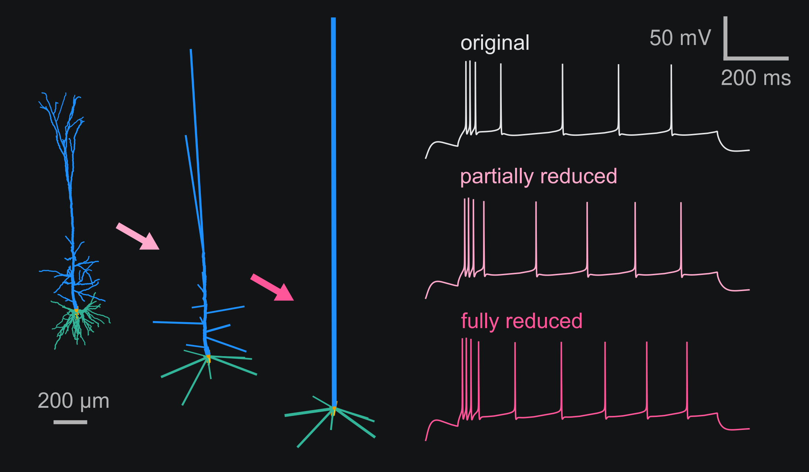
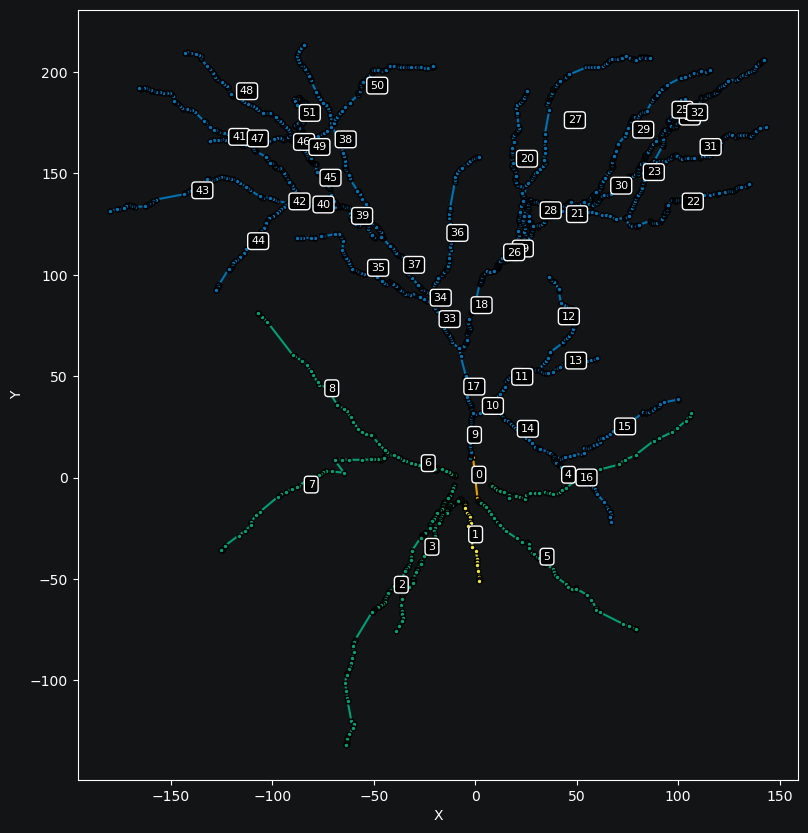
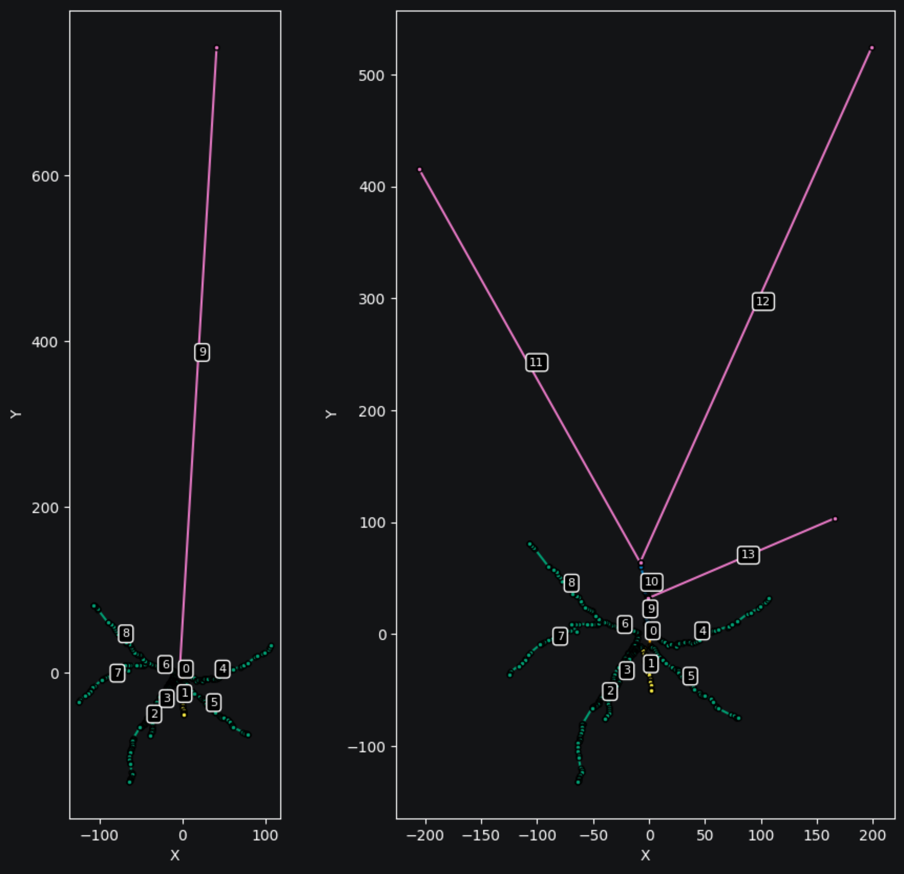
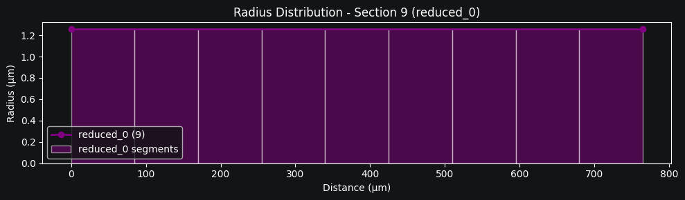
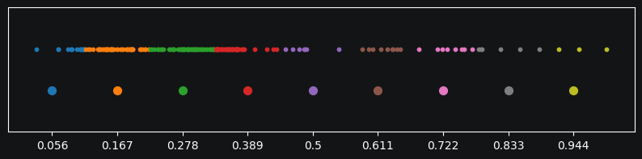
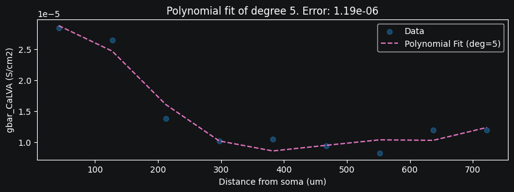

Simplifying Neuronal Morphology
==========================================

In this tutorial, we will demonstrate how to reduce a subtree of a neuron to a single equivalent cylinder.
We will also show how to map the parameters of the original segments to the reduced segments.

Here, we follow the analytical impedance-based approach proposed by Amsalem et al., 2020 (:code:`neuron_reduce`)

.. admonition:: Citation 

    Amsalem, O., Eyal, G., Rogozinski, N. et al. An efficient analytical reduction of detailed nonlinear neuron models. Nat Commun 11, 288 (2020). https://doi.org/10.1038/s41467-019-13932-6

We have integrated the reduction algorithm in DendroTweaks and extended its functionality 
to allow for a continuum of morphology reduction levels, 
bridging detailed and "ball-and-stick"-like models. 
You can select any section of the cell and reduce its subtree, 
which allows for any intermediate level of detail to be achieved. 

    *Figure 1: Extended neuron_reduce functionality allows for a continuum of morphology reduction levels*

Let's explore how we can reduce a subtree of a neuron and map the parameters of the original segments to the reduced segments.

Visualizing the Cell Structure
-------------------------------

First, we need to visualize the section tree of our model. Assuming we have already loaded a model, we can run:

.. code-block:: python

    >>> fig, ax = plt.subplots(figsize=(10, 10))
    >>> model.sec_tree.plot(ax, show_points=True, show_lines=True, 
    ...             annotate=True, projection='XY', show_domains=True)

    *Figure 2: Section tree visualization with sections annotated by their indexes*

Reducing a Subtree
-------------------

Now, let's consider a scenario where we want to reduce the entire apical subtree of the cell to a single equivalent cylinder.
We begin by selecting the root section of the subtree we want to reduce:

.. code-block:: python

    >>> root = model.sec_tree[9]

Next, we reduce the subtree of the root section to a single equivalent cylinder:

.. code-block:: python

    >>> model.reduce_subtree(root)
    CableParams(
        length=764.4880869429425, 
        diam=2.5167596659270863, 
        space_const=831.9308313375269, 
        cm=2.0, 
        rm=11000.0, 
        ra=100.0, 
        e_leak=-79.0, 
        electrotonic_length=0.9189322695419833
    )

The function returns the parameters of the new equivalent cylinder. We can see that the algorithm has calculated the appropriate length, diameter, and other electrical properties to maintain the key electrical characteristics of the original subtree.

Visualizing the Reduced Cell
-----------------------------

Let's examine how our cell looks after we have reduced the apical subtree:

    *Figure 3: The cell after apical subtree reduction*

On the right side of the figure, we can see another possible reduction level where only some branches of the apical subtree are reduced.
For this tutorial, we will proceed with the full reduction of the apical subtree.

We can visualize the geometry of the reduced section:

    *Figure 4: Visualization of the reduced section's radii*

Mapping Channel Parameters
---------------------------

An important aspect of our reduction method is handling the parameters of active channels that were present in the original subtree.

The following figure shows the mapping of original segments to reduced segments. The x-axis represents the normalized length of the subtree based on transfer impedance values. The top part shows the original segments, while the bottom shows the reduced segments. Ticks on the x-axis mark the centers of the reduced segments, and colors indicate how original segments map to reduced segments.

    *Figure 5: Mapping between original segments and reduced segments*

When we reduce a subtree, the value of a given parameter in each reduced segment is the average of the values from the original segments that map to it.

Formalizing the Resultant Distribution
----------------------------------------------

The reduction process creates a new domain named :code:`reduced_0` containing only the reduced section. 
This domain is used to create a targeted segment group with the same name that specifies the averaged parameter distributions.

To represent the values of the new averaged distribution in a compact, segmentation-agnostic form, we fit a polynomial to the resultant parameter values within the reduced section. Let's visualize this distribution and its polynomial fit:

    *Figure 6: Polynomial fit of a parameter distribution in the reduced section*

We can access the coefficients of this polynomial fit in the model's parameters:

.. code-block:: python

    >>> model.params['gbar_CaLVA']['reduced_0']
    polynomial({'coeffs': array([-4.88293485e-20,  1.16592185e-16, -1.07986828e-13,  4.85483580e-11,
        -1.06540269e-08,  9.35371031e-07,  4.53180944e-06])})

This compact representation means we can modify the distribution, update the segmentation later, and export/import the membrane configuration of the reduced model just as with any other model.

How Does It Work?
------------------

The original :code:`neuron_reduce` algorithm maps a dendritic subtree to a single cylinder with both ends sealed, preserving:

- specific membrane resistivity, :math:`R_m` in :math:`\Omega \cdot cm^2`
- specific membrane capacitance, :math:`C_m` in :math:`F/cm^2`
- specific axial resistivity, :math:`R_a` in :math:`\Omega \cdot cm`
- the transfer impedance from the electrotonically most distal dendritic tip to the soma, :math:`|Z_{0,L}(\omega)|`
- the input resistance at the soma end (when disconnected from the soma), :math:`|Z_{0,0}(\omega)|`

Equations (1)–(11) in the original Amsalem et al., 2020 paper describe the unique cylindrical 
cable (with a specific diameter :math:`d` and length :math:`L`, and the given membrane 
and axial properties) that preserves the values of :math:`|Z_{0,L}(\omega)|` and :math:`|Z_{0,0}(\omega)|`. 

In the original implementation, the entire subtree of each stem dendrite 
(e.g., the entire apical subtree) is mapped to a single corresponding cylinder. 
We have extended this approach to allow users to select any section and 
map the inclusive subtree of this section (including the root section itself) to 
a single cylinder.

When you select a root section which subtree you want to reduce, the following steps are performed:

1. The inclusive subtree is temporarily disconnected from the cell and all active mechanisms are removed
2. Passive properties for the equivalent cylinder are calculated
3. The exclusive subtree of the section is removed
4. The root section's length and diameter are updated with the new calculated values
5. The root section is reconnected to its original parent and the active mechanisms are restored
6. The parameters of the original segments are averaged and mapped to the reduced segments
7. The new domain and segment group are created
8. The parameters of the reduced section are fitted with a polynomial

As in the original method, the reduced model is compartmentalized into segments 
(typically with a spatial resolution of 0.1 :math:`\lambda`), and channel 
conductances are adjusted according to the mapping between the original 
and the reduced segments.

.. warning::

    We have temporarily removed the step from the original algorithm that mapped synapses to the reduced 
    cylinder. Currently, to reduce a subtree, you need to remove all stimuli and recordings from it.
    This functionality will be restored in a future release of DendroTweaks.