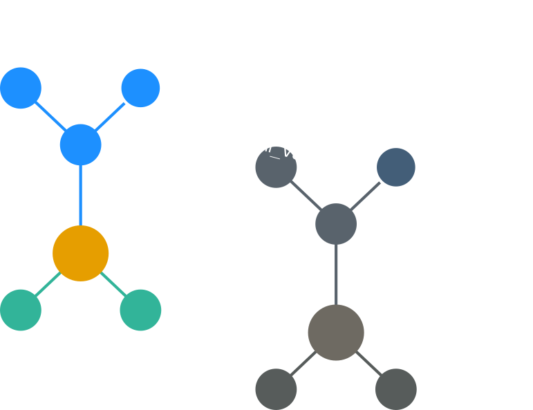

Choosing a Simulator
====================

.. warning::

    Compatibility with simulators other than NEURON is currently under development.

DendroTweaks acts as a layer on top of a simulator to provide a high-level interface, additional functionality, and enable connection with the GUI.
The following simulatord are currently supported:

- `NEURON <https://neuron.yale.edu/neuron/>`_

Planned support for the following simulators:

- `Jaxley <https://jaxleyverse.github.io/jaxley>`_

.. tip::

    While support for Jaxley is an ongoing effort, you can already automatically create Jaxley-compatible ion channel classes from MOD files using DendroTweaks.
    Learn more about creating ion channels in :doc:`this tutorial</tutorials/tutorial_mod>`.

Creating and Referencing Sections in a Simulator
------------------------------------------------

Once we have created an instance of a :code:`Model` and a :code:`SectionTree`, we can reference the sections in the simulator. The following code snippet demonstrates how to reference the sections in NEURON.

.. code-block:: python

    >>> model.reference_sections(simulator='NEURON')
    Created 52 sections in NEURON. Use section._ref to access the NEURON section.

Now each DendroTweaks :term:`Section` is associated with a simulator-specific section. The user can access the simulator-specific section using the :code:`_ref` attribute.

.. code-block:: python

    >>> soma = model.get_sections(lambda sec: sec.domain == 'soma')[0]
    >>> soma._ref
    <nrn.Section at 0x7f8b3b3b3b50>

