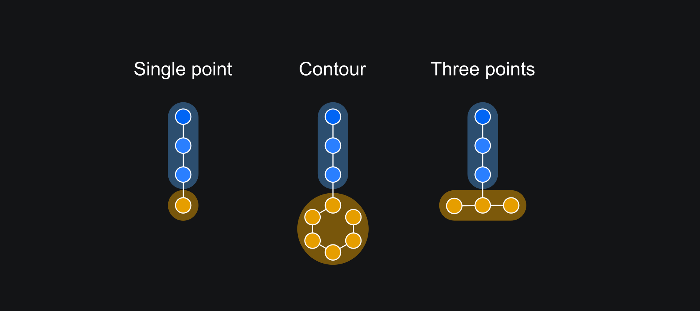
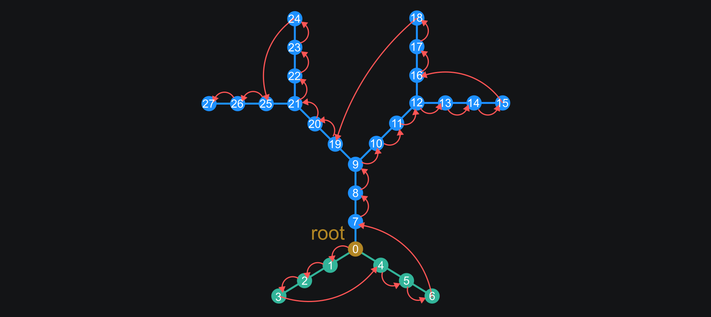
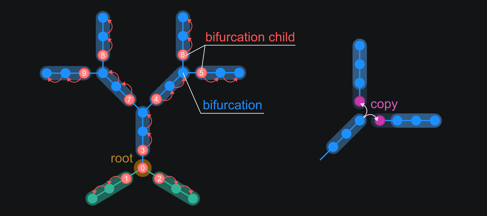

Working with SWC files
==========================================

SWC files are a standard format for representing neuronal morphology, containing detailed spatial information about neuronal structures. 
This tutorial explains how to process SWC files using the DendroTweaks library.

Reading SWC Files
------------------------------------------

The first step in neuronal morphology analysis is reading the SWC file. DendroTweaks provides a straightforward method to load SWC data into a pandas DataFrame:

.. code-block:: python

    >>> from dendrotweaks.morphology.io import SWCReader
    >>> reader = SWCReader()
    >>> df = reader.read('path/to/swc_file.swc')

For initial data exploration, you can use standard pandas operations:

.. code-block:: python

    >>> df.head()  # Inspect the first few rows
    >>> df.info()  # Get detailed DataFrame information

Note that DendroTweaks handles most preprocessing steps automatically.

Creating a point tree
------------------------------------------

While the DataFrame provides a convenient way to manipulate data, a tree structure is more suitable for morphological analysis.
The :code:`PointTree` class represents a tree structure of neuronal points, with each node containing spatial information.
To create a point tree from the DataFrame, use the :code:`create_point_tree` function:

.. code-block:: python

    >>> from dendrotweaks.morphology.io import create_point_tree
    >>> point_tree = create_point_tree(df)

.. tip:: 
    
    You can directly pass the path to the SWC file to the 
    :code:`create_point_tree` method if you don't need additional preprocessing.

Postprocessing
------------------------------------------

Once we have the point tree, we can perform various postprocessing steps to refine and standardize the morphological data.
We will start by removing overlapping nodes:

.. code-block:: python

    >>> point_tree.remove_overlaps()
    Removed 10 overlapping nodes

Soma notation
~~~~~~~~~~~~~~~~~~~~~~~~~~~~~~

Next, we will check and standardize the soma notation.
The soma can be represented in three ways in SWC files:

* Three-point soma: soma represented by three points
* One-point soma: soma represented by a single point
* Contour: set of points defining the soma boundary

NeuroMorpho.org considers the three-point soma notation the standard representation.
For more details, see the `Soma format representation in NeuroMorpho.Org <https://neuromorpho.org/SomaFormat.html>`_

    *Figure 1: Different soma notations*

To check the current soma notation we can use the :code:`soma_notation` property:

.. code-block:: python

    >>> point_tree.soma_notation
    1PS

We can change the soma notation to the three-point soma using the :code:`change_soma_notation` method:

.. code-block:: python

    >>> point_tree.change_soma_notation('3PS')
    Changed soma notation to 3PS

.. note::

    Converting to contour notation is not supported.

Sorting the tree
~~~~~~~~~~~~~~~~~~~~~~~~~~~~~~

We now want to make sure that the nodes are properly sorted.
For this we will perform depth-first traversal of the tree and update each node's index as we visit the node.

.. code-block:: python

    >>> point_tree.sort()

The figure below illustrates the traversal and sorting process:

    *Figure 2: Traversing and sorting the point tree*

.. tip::

    The :code:`sort` method relies on a more generic :code:`traverse` method, which can be used to perform various operations on the tree nodes.
    However, once the tree is sorted, it is more efficient to iterate directly over the :code:`point_tree.points` attribute.

Shifting and aligning the tree
~~~~~~~~~~~~~~~~~~~~~~~~~~~~~~~

We can also shift the tree to the soma center and align the apical dendrite with the vertical axis.

.. code-block:: python

    >>> point_tree.shift_coordinates_to_soma_center()
    >>> point_tree.align_apical_dendrite(axis='Y', facing='up') 
    >>> point_tree.round_coordinates(5)

The :code:`align_apical_dendrite` method should be used only for cells with an apical dendrite.
The :code:`round_coordinates` method rounds the coordinates to the specified number of decimal places.

We can also rotate the tree around a specific axis:

.. code-block:: python

    >>> point_tree.rotate(angle=90, axis='Y')

Creating a section tree
------------------------------------------

Now we are ready to create a section tree from the point tree.
The :code:`create_section_tree` function splits the point tree into sections based on the bifurcation points:

.. code-block:: python

    >>> from dendrotweaks.morphology.io import create_section_tree
    >>> sec_tree = create_sec_tree(point_tree)

This method assigns each node to a section, as shown below:

    *Figure 3: Splitting the point into sections*

Note that with this sectioning algorithm, bifurcation points are assigned to the parent section.
To maintain correct section geometry, we need to copy these points to the child sections, ensuring each section starts where its parent ends.
While geometrically "disconnected" parts of the tree may still yield accurate simulation results if parent-child relationships are preserved, 
copying bifurcation nodes enhances section geometry accuracy.

Modifying tree structure
------------------------------------------

We can modify the tree by adding, removing, or repositioning nodes.
The methods below are defined for the more generic :code:`Tree` class,
and are therefore available for both :code:`PointTree` and :code:`SectionTree` classes.
Below are some examples of how to modify the tree structure:

.. code-block:: python

    >>> pt = point_tree.points[100]
    >>> point_tree.remove_node(pt)
    >>> point_tree.sort()

Here we remove a node from the point tree, disconnecting it from its parent and children.
Afterward, we delete the node from the tree and sort the tree to update the node indices.
We can also remove an entire subtree of a given node (including the node itself):

.. code-block:: python

    >>> sec = sec_tree.sections[10]
    >>> sec_tree.remove_subtree(sec)
    >>> sec_tree.sort()

We can also detach a subtree from the parent and re-attach it to another node.

.. code-block:: python

    >>> pt = point_tree.points[100]
    >>> new_parent = point_tree.points[200]
    >>> point_tree.reposition_subtree(pt, new_parent=new_parent)
    >>> point_tree.sort()

In this example, we detach the subtree rooted at node 100 from its parent and reattach it to node 200.
It is important to sort the tree after repositioning nodes to maintain the correct index order.

Validation
------------------------------------------

Finally, we can validate the tree structure by checking the following criteria:

* Unique node IDs
* A single root node
* No duplicate entries in children lists
* Valid connectivity (each node can be reached from the root)
* Absence of loops
* Neurites are binary trees (each node has at most two children)
* Nodes are sorted (by depth-first traversal)

Additionally, for the point tree:

* No overlapping nodes
* No bifurcation points within the soma, except for the root node
* All coordinates and radii have been assigned a value

Additionally, for the section tree:

* The domains of the points in each section match the section's domain
* No sections have zero length

.. code-block:: python

    >>> from dendrotweaks.morphology import validate_tree
    >>> validate_tree(sec_tree)

Note that validation for the section tree includes validation for the point and segment trees as well.

With these steps, we have successfully processed the SWC file and created a standardized tree structure ready for further analysis and simulation.
