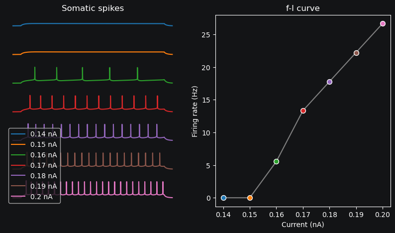
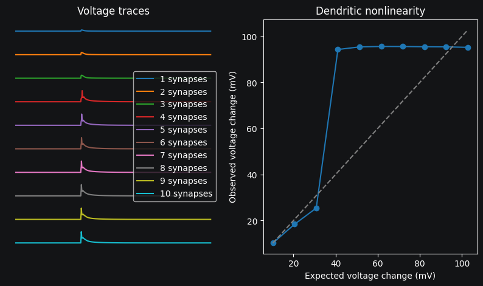

Analyzing Neural Models
=========================================

This tutorial will guide you through the process of analyzing computational neuron models using DendroTweaks. 
You will learn how to quantify morphological properties, measure passive electrical characteristics, 
and analyze neuronal firing patterns.

Introduction to Morphometric Analysis
--------------------------------------

Understanding a neuron's physical structure is crucial for interpreting its function. 
DendroTweaks provides tools to quantify various aspects of neuronal morphology, 
from basic measurements to domain-specific analyses.

Basic Cell Statistics
~~~~~~~~~~~~~~~~~~~~~

Let's start by examining the overall morphological properties of our neuron model:

.. code-block:: python

    >>> from dendrotweaks.analysis import calculate_cell_statistics
    >>> stats = calculate_cell_statistics(model)
    >>> stats
    {
        'N_sections': 52,
        'N_bifurcations': 22,
        'N_terminations': 29,
        'depth': {
            'min': 0,
            'max': 8,
            'counts': {0: 1, 1: 7, 2: 4, 3: 4, 4: 8, 5: 8, 6: 6, 7: 8, 8: 6}
        },
        'diam': {'min': 0.38, 'max': 20.44, 'mean': 1.2, 'std': 2.75},
        'length': {'min': 4.51, 'max': 155.32, 'mean': 64.62, 'std': 39.34},
        'area': {'min': 17.6, 'max': 1312.27, 'mean': 176.39, 'std': 185.8},
        'total_length': 3360.28,
        'total_area': 9172.03
    }

What are we seeing here? The function returns a comprehensive dictionary containing:

- **Topological metrics**: The number of compartment sections (`N_sections`), branch points (`N_bifurcations`), and endpoints (`N_terminations`) tell us about the neuron's complexity.
- **Tree depth**: The `depth` field shows how many branch levels exist in our neuron model. This model has branches extending from level 0 (the soma) to level 8, with the `counts` showing how many sections exist at each level.
- **Geometric properties**: The `diam` (diameter), `length`, and `area` fields provide statistical summaries (minimum, maximum, mean, and standard deviation) of these physical dimensions across all compartments.
- **Total measurements**: The `total_length` and `total_area` give us the cumulative values for the entire neuron.

These metrics help us understand the neuron's overall size, complexity, and branching structure.

Domain-Specific Analysis
~~~~~~~~~~~~~~~~~~~~~~~~

Neurons have functionally distinct compartments (domains) like dendrites, axons, and soma. To analyze specific domains:

.. code-block:: python

    >>> from dendrotweaks.analysis import calculate_domain_statistics
    >>> stats = calculate_domain_statistics(model, domain_names=['apic'])
    >>> stats
    {
        'apic': {
            'N_sections': 43,
            'N_bifurcations': 21,
            'N_terminations': 22,
            'depth': {
                'min': 1,
                'max': 8,
                'counts': {1: 1, 2: 2, 3: 4, 4: 8, 5: 8, 6: 6, 7: 8, 8: 6}
            },
            'diam': {'min': 0.38, 'max': 2.06, 'mean': 0.82, 'std': 0.45},
            'length': {'min': 4.51, 'max': 154.69, 'mean': 58.31, 'std': 35.75},
            'area': {'min': 17.6, 'max': 271.28, 'mean': 130.52, 'std': 74.2},
            'total_length': 2507.17,
            'total_area': 5612.19
        }
    }

In this example, we're focusing on the apical dendrites ('apic'). The function returns the same comprehensive metrics as before, but limited to just this domain. 

Note how the apical dendrites account for most of the neuron's sections (43 out of 52), and have their own distinctive properties. The mean diameter of the apical dendrites (0.82 μm) is smaller than the overall mean (1.2 μm), indicating that some other domain (likely the soma) has larger diameters.

You can analyze multiple domains simultaneously by passing a list of domain names, such as :code:`domain_names=['soma', 'apic', 'dend', 'axon']`.

Electrophysiological Analysis
-----------------------------

Now that we understand the neuron's structure, let's examine its electrical properties and response patterns.

Passive Membrane Properties
~~~~~~~~~~~~~~~~~~~~~~~~~~~

Passive properties describe how neurons respond to small inputs when voltage-gated channels are not activated. Key properties include input resistance and membrane time constant, which influence how the neuron integrates synaptic inputs.

To measure these properties, we will inject a small hyperpolarizing current into the soma:

.. code-block:: python

    >>> model.add_iclamp(soma, loc=0.5, amp=-0.01, dur=900, delay=50)
    >>> model.run(1000)  # Run simulation for 1000 ms

Let's break down this code:

- `add_iclamp` adds an intracellular current clamp to the soma at position 0.5 (middle of the section)
- We use a negative amplitude (-0.01 nA) to hyperpolarize the membrane
- The current starts after a 50 ms delay and lasts for 900 ms
- We run the simulation for a total of 1000 ms to observe the full response

Now we can visualize and analyze the response:

.. code-block:: python

    >>> from dendrotweaks.analysis import calculate_passive_properties
    >>> data_passive = calculate_passive_properties(model)

.. code-block:: python

    >>> import matplotlib.pyplot as plt
    >>> from dendrotweaks.analysis import plot_passive_properties
    >>> fig, ax = plt.subplots(figsize=(10, 5))
    >>> model.simulator.plot_voltage(ax=ax)
    >>> plot_passive_properties(data_passive, ax=ax)
    Input resistance: -119.22 MOhm
    Membrane time constant: 17.38 ms

.. figure:: ../_static/passive_properties.png
    :align: center
    :width: 70%
    :alt: Passive properties of the model

    *Figure 1. Passive properties of the model*

The :code:`plot_passive_properties` function:

1. Calculates the input resistance by measuring the voltage deflection divided by the injected current (using Ohm's law: R = V/I)
2. Calculates the membrane time constant (tau) by fitting an exponential curve to the voltage decay
3. Displays these metrics and annotates the plot

These passive properties tell us:

- The **input resistance** (119.22 MΩ) indicates how much the membrane potential will change in response to a given current input
- The **membrane time constant** (17.38 ms) indicates how quickly the membrane responds to changes in input, reflecting the cell's capacitance and resistance

Action Potential Generation and Analysis
~~~~~~~~~~~~~~~~~~~~~~~~~~~~~~~~~~~~~~~~

To study how the neuron generates action potentials (spikes), we will reset the model and apply a depolarizing current:

.. code-block:: python

    >>> model.remove_all_iclamps()  # Clear previous current injections
    >>> model.add_iclamp(soma, loc=0.5, amp=0.162, dur=900, delay=50)

This time we're using a positive current (0.162 nA) to depolarize the membrane above its threshold, triggering action potentials. Now let's analyze the resulting spike pattern:

.. code-block:: python

    >>> from dendrotweaks.analysis import detect_somatic_spikes
    >>> model.run(1000)
    >>> spike_data = detect_somatic_spikes(model)
    
.. code-block:: python

    >>> from dendrotweaks.analysis import plot_spikes
    >>> fig, ax = plt.subplots(1, 1, figsize=(10, 4))
    >>> model.simulator.plot_voltage(ax=ax)
    >>> plot_spikes(spike_data, ax, show_metrics=True)
    Detected 7 spikes
    Average spike width: 0.97 ms
    Average spike amplitude: 79.08 mV
    Spike frequency: 7.78 Hz

.. figure:: ../_static/voltage_trace.png
    :align: center
    :width: 80%
    :alt: Voltage trace with detected spikes

    *Figure 2. Voltage trace with detected spikes*

The :code:`detect_somatic_spikes` function identifies action potentials in the voltage trace using threshold detection. The `plot_spikes` function then visualizes and analyzes these spikes, providing several important metrics:

- **Spike count**: The neuron fired 7 action potentials during the stimulation
- **Spike width**: The average duration of each action potential (0.97 ms)
- **Spike amplitude**: The average height of the action potentials (79.08 mV)
- **Firing frequency**: The average rate of action potential generation (7.78 Hz)

These metrics characterize the neuron's intrinsic excitability and action potential shape, which are determined by the types and densities of ion channels in the membrane.

Frequency-Current (f-I) Relationship
~~~~~~~~~~~~~~~~~~~~~~~~~~~~~~~~~~~~

A key characteristic of neurons is how their firing rate changes with input strength. The frequency-current (f-I) relationship helps identify the neuron's computational properties and cell type.

Let's measure this relationship:

.. code-block:: python

    >>> from dendrotweaks.analysis import calculate_fI_curve
    >>> from dendrotweaks.analysis import plot_fI_curve
    >>> fI_data = calculate_fI_curve(model, min_amp=0.140, max_amp=0.200, n=7)
    >>> fig, ax = plt.subplots(1, 2, figsize=(10, 5))
    >>> plot_fI_curve(fI_data, ax=ax)

    *Figure 3. f-I curve showing relationship between input current and firing frequency*

The :code:`plot_fI_curve` function:

1. Automatically tests multiple current amplitudes (7 values ranging from 0.140 to 0.200 nA)
2. Measures the firing frequency in response to each current level
3. Plots both the individual voltage traces and the resulting f-I curve

From this analysis, we can observe:

- The **rheobase** (minimum current needed to elicit spiking)
- The **gain** (slope of the f-I curve, indicating sensitivity to input changes)
- The presence of any **saturation** effects at higher current levels

Different neuron types have characteristic f-I curves. For example, some neurons show a linear relationship between current and frequency, while others display adaptation or saturation.

Voltage Attenuation In Dendrites
~~~~~~~~~~~~~~~~~~~~~~~~~~~~~~~~~~~~

Voltage attenuation refers to the decrease in voltage amplitude 
as signals propagate along dendrites. 
This phenomenon is crucial for understanding how synaptic inputs 
are integrated and how information is processed in the neuron.

Let's visualize voltage attenuation in different dendritic locations for 
a current injected at a terminal dendritic branch as the signal propagates towards the soma:

To set up the experiment we need to add a current clamp to a dendritic branch and record the voltage at multiple locations:

.. code:: python

    >>> model.remove_all_stimuli(), model.remove_all_recordings()
    >>> secs = [model.sec_tree[i] for i in [0, 9, 17, 18, 21, 22]]
    >>> for sec in secs:
    ...     model.add_recording(sec, loc=0.5)
    >>> apical_branch = model.sec_tree[22]
    >>> model.add_iclamp(apical_branch, loc=0.5, amp=-0.01, dur=1000, delay=50)

Now we can run the simulation and plot the results:

.. code:: python

    >>> from dendrotweaks.analysis import calculate_voltage_attenuation
    >>> model.run(1000)
    >>> attenuation_data = calculate_voltage_attenuation(model)

.. code:: python

    >>> from dendrotweaks.analysis import plot_voltage_attenuation
    >>> fig, ax = plt.subplots(1, 1, figsize=(10, 5))    
    >>> plot_voltage_attenuation(model, ax)

The :code:`plot_voltage_attenuation` function:

.. figure:: ../_static/attenuation.png
    :align: center
    :width: 50%
    :alt: Voltage attenuation in dendrites

    *Figure 4. Voltage attenuation in dendrites (dendritic injection)*

Dendritic Nonlinearities
~~~~~~~~~~~~~~~~~~~~~~~~~~~~~~~~~~~~

Dendrites are not passive cables; they actively process synaptic inputs through various mechanisms like voltage-gated channels and NMDA receptors.
These nonlinearities can significantly impact the neuron's integrative properties and information processing.

To study dendritic nonlinearities, we can gradually increase the synaptic input at a dendritic location and observe the resulting voltage response:

To set up the experiment, we need to place a synapse on a dendritic branch and record the voltage at the same location:

.. code:: python

    >>> model.remove_all_stimuli(), model.remove_all_recordings()
    >>> sec = model.sec_tree[22]
    >>> model.add_recording(sec, loc=0.5)
    >>> segments = [sec(0.5)]
    >>> model.add_recording(sec, loc=0.5)
    >>> model.add_population(segments, N=1, syn_type='AMPA')

The :code:`plot_dendritic_nonlinearity` function will then gradually increase the synaptic weight and plot the resulting voltage response:

.. code:: python

    >>> from dendrotweaks.analysis import calculate_dendritic_nonlinearity
    >>> nonlinearity_data = calculate_dendritic_nonlinearity(
    ...     model, 
    ...     duration=300, 
    ...     max_weight=10, 
    ...     n=10
    ... )

.. code:: python

    >>> from dendrotweaks.analysis import plot_dendritic_nonlinearity
    >>> fig, ax = plt.subplots(1, 2, figsize=(10, 5))
    >>> plot_dendritic_nonlinearity(nonlinearity_data, ax=ax)

    *Figure 5. Dendritic nonlinearity (terminal apical branch)*

On the left, we see the voltage response to increasing synaptic weights, showing how the dendrite integrates and amplifies synaptic inputs.
On the right, we see the resulting nonlinear relationship between expected and observed voltage responses, highlighting the dendrite's complex processing capabilities.